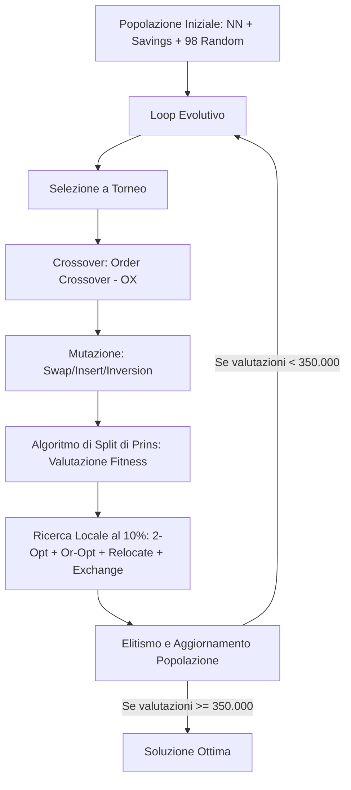

# Teoria e Architettura del Risolvitore CVRP (HGA)

Questo documento fornisce una spiegazione dettagliata e accademica dei concetti teorici, degli algoritmi e delle scelte implementative adottate nel progetto per la risoluzione del **Capacitated Vehicle Routing Problem (CVRP)** tramite **Algoritmo Genetico Ibrido (HGA)**.

---

## 1. Il Problema: Capacitated Vehicle Routing Problem (CVRP)

Il CVRP è un classico problema di ottimizzazione combinatoria NP-difficile. Può essere formalizzato come segue:

### Formulazione Matematica e Vincoli
Dato un grafo orientato o non orientato $G = (V, E)$, dove:
*   $V = \{0, 1, \dots, n\}$ è l'insieme dei nodi. Il nodo $0$ rappresenta il **deposito centrale (depot)**, mentre i nodi $\{1, \dots, n\}$ sono i **clienti**.
*   Ogni cliente $i \in V \setminus \{0\}$ ha una richiesta (domanda) associata $d_i > 0$.
*   Un insieme omogeneo di veicoli, ciascuno con capacità limitata $Q$.
*   Una matrice delle distanze $C$ dove $c_{ij}$ rappresenta il costo di viaggio (distanza euclidea) tra il nodo $i$ e il nodo $j$.

L'obiettivo è determinare un insieme di percorsi di costo minimo tali che:
1.  Ogni percorso parta e termini al deposito $0$.
2.  Ogni cliente venga visitato **esattamente una volta** da un solo veicolo.
3.  La somma delle domande dei clienti in qualsiasi percorso non superi la capacità del veicolo $Q$:
    $$\sum_{i \in R_k} d_i \le Q \quad \forall R_k$$

---

## 2. L'Algoritmo Genetico Ibrido (HGA) o Memetico

Un algoritmo genetico classico modella i processi di selezione naturale ed evoluzione (crossover, mutazione). Tuttavia, per problemi complessi come il VRP, l'algoritmo genetico da solo rischia di convergere molto lentamente.

L'**HGA** (chiamato anche **Algoritmo Memetico**) unisce:
*   La capacità di esplorazione globale (**exploration**) dell'algoritmo genetico.
*   La capacità di raffinamento locale (**exploitation**) degli operatori di ricerca locale.

### Parametri e Protocollo Sperimentale (da Consegna)
L'algoritmo è governato da una serie di parametri chiave, definiti in `config/config.yaml`, che regolano il bilanciamento tra esplorazione e sfruttamento:

*   **Dimensione della popolazione ($N = 100$)**: Definisce il numero di soluzioni candidate mantenute contemporaneamente in memoria. Una popolazione più ampia favorisce la diversità genetica ma aumenta il tempo di calcolo.
*   **Valutazioni massime ($FE = 350.000$)**: Rappresenta il budget computazionale totale concesso all'HGA per ogni singola esecuzione. Il conteggio delle valutazioni viene incrementato a ogni invocazione del metodo di Split.
*   **Numero di run indipendenti ($\text{runs} = 5$)**: Poiché l'HGA è un algoritmo stocastico, è necessario eseguire più run indipendenti per ciascuna istanza per raccogliere statistiche statisticamente significative (costo migliore, costo medio, deviazione standard).
*   **Tasso di Crossover ($p_c = 0.8$)**: La probabilità con cui due genitori estratti dalla popolazione si incrociano (tramite Order Crossover - OX) per generare figli. Favorisce la trasmissione delle buone caratteristiche dei genitori alle generazioni successive.
*   **Tasso di Mutazione ($p_m = 0.1$)**: La probabilità che un figlio subisca una mutazione casuale. Introduce elementi di disturbo che prevengono la convergenza prematura su ottimi locali sub-ottimali.
*   **Tasso di Ricerca Locale ($p_{ls} = 0.1$)**: La probabilità che un figlio venga ottimizzato tramite i 4 operatori di ricerca locale. È il tasso di ibridazione che definisce l'algoritmo memetico.
*   **Dimensione del torneo ($k = 2$)**: Il numero di candidati estratti a caso per sfidarsi nella selezione dei genitori. Controlla la pressione selettiva dell'algoritmo genetico.
*   **Quota di Elitismo ($e = 2$)**: Il numero di individui migliori della generazione precedente che vengono copiati inalterati nella generazione successiva, garantendo la non-decrescenza della fitness ottima trovata.
*   **Iterazioni massime di Ricerca Locale ($\text{max\_iter} = 2$)**: Limita la scansione degli operatori di ricerca locale inter-route (Relocate ed Exchange) per evitare cicli infiniti ed ottimizzazioni infinitesimali, massimizzando il rendimento globale del tempo CPU.

---

## 3. Rappresentazione del Cromosoma e Algoritmo di Split di Prins

Una delle sfide principali del VRP è codificare una soluzione in un cromosoma (stringa). Esistono due modi:
1.  **Con delimitatori di percorso**: inserire degli "0" o dei delimitatori per separare i veicoli (es. `[0, 1, 2, 0, 3, 4, 5, 0]`). Questo approccio rende il crossover complesso e crea figli non validi.
2.  **Senza delimitatori (Permutazione semplice)**: Il cromosoma è solo una sequenza dei clienti (es. `[1, 2, 3, 4, 5]`). Viene usato un algoritmo ausiliario per determinare in modo ottimale dove spezzare la sequenza in rotte valide. Nel nostro progetto è implementato il secondo approccio tramite l'**Algoritmo di Split di Prins (2004)**.

### Algoritmo di Split (Programmazione Dinamica)
Dato un cromosoma $P = (p_1, p_2, \dots, p_n)$, definiamo un grafo ausiliario $H = (V_H, A_H)$ privo di cicli, dove i nodi sono gli indici da $0$ a $n$.
Un arco orientato $(i, j)$ (con $i < j$) esiste se il sottosegmento di clienti $(p_{i+1}, \dots, p_j)$ può essere servito da un singolo veicolo senza superare la capacità $Q$:
$$\sum_{k=i+1}^{j} d_{p_k} \le Q$$

Il costo dell'arco $(i, j)$ è pari al costo della rotta corrispondente:
$$w(i, j) = c_{0, p_{i+1}} + \sum_{k=i+1}^{j-1} c_{p_k, p_{k+1}} + c_{p_j, 0}$$

Il problema di trovare il partizionamento ottimale equivale a trovare il **cammino minimo** dal nodo $0$ al nodo $n$ nel grafo $H$. Questo cammino viene calcolato in tempo $O(N^2)$ usando la seguente equazione di ricorrenza di programmazione dinamica:
$$V(j) = \min_{i < j \text{ s.t. } \text{load}(i+1 \dots j) \le Q} \{ V(i) + w(i, j) \}$$
dove $V(j)$ rappresenta il costo ottimale per servire i primi $j$ clienti della permutazione.

---

## 4. Generazione della Popolazione Iniziale

La popolazione iniziale contiene 100 soluzioni:
1.  **1 soluzione** creata tramite l'euristica **Nearest Neighbor**:
    *   Partendo dal deposito, aggiunge ad ogni passo il cliente più vicino non ancora visitato che non viola la capacità residua. Se la capacità viene superata, il veicolo torna al deposito e un nuovo veicolo ricomincia il ciclo.
2.  **1 soluzione** creata tramite l'euristica **Savings (Clarke & Wright)**:
    *   Inizializza ciascun cliente in una rotta dedicata $0 \to i \to 0$.
    *   Calcola i risparmi energetici (savings) ottenuti unendo le rotte di $i$ e $j$: $s_{ij} = c_{i0} + c_{0j} - c_{ij}$.
    *   Ordina i risparmi in modo decrescente e unisce le rotte compatibili con il limite di capacità $Q$.
3.  **98 soluzioni** create tramite **Permutazioni Casuali**:
    *   I clienti vengono mescolati in modo casuale per garantire la massima varietà genetica.

Tutte queste permutazioni vengono poi passate all'algoritmo di Split per valutarne la fitness originaria.

---

## 5. Operatori Genetici

### Selezione
Viene utilizzata la **Selezione a Torneo (Tournament Selection)** con dimensione $k = 3$.
Si scelgono a caso 3 individui dalla popolazione e si seleziona quello con la fitness (costo) minore. Questo metodo offre un ottimo equilibrio tra pressione selettiva (far evolvere i migliori) e mantenimento della diversità genetica.

### Crossover: Order Crossover (OX)
L'Order Crossover è l'operatore ideale per le permutazioni perché preserva l'ordine relativo dei nodi evitando duplicati.
1.  Si scelgono due punti di taglio casuali all'interno dei cromosomi dei genitori.
2.  Il figlio eredita il segmento racchiuso tra i due tagli direttamente dal primo genitore.
3.  Le posizioni rimanenti del figlio vengono riempite scorrendo in senso orario gli elementi del secondo genitore (a partire dal secondo punto di taglio), saltando i nodi già ereditati.

### Mutazione
Per evitare la convergenza prematura, il $10\%$ dei figli subisce una mutazione. L'operatore di mutazione viene scelto a caso tra:
*   **Swap Mutation** ($40\%$ delle volte): Scambia di posizione due clienti scelti a caso nel cromosoma.
*   **Insert Mutation** ($30\%$ delle volte): Rimuove un cliente da una posizione e lo inserisce in un'altra.
*   **Inversion Mutation** ($30\%$ delle volte): Inverte l'ordine di un intero segmento casuale del cromosoma.

---

## 6. Ricerca Locale (Local Search)

La ricerca locale opera su una soluzione per migliorarla fino ad un ottimo locale. Nel nostro HGA, viene applicata con una probabilità del $10\%$ sui nuovi figli ed esegue in sequenza quattro operatori:

### Intra-Route (Ottimizzazione all'interno della stessa rotta)
1.  **2-opt**: Rimuove due archi non adiacenti della rotta e ricollega i nodi invertendo il segmento compreso tra essi. Serve a eliminare gli incroci di percorsi.
    *   *Calcolo dei costi accelerato*: Si calcola la differenza di costo (delta) guardando solo gli archi di frontiera:
        $$\Delta = (c_{i, j} + c_{i+1, j+1}) - (c_{i, i+1} + c_{j, j+1})$$
2.  **Or-opt**: Rimuove un segmento contiguo di clienti (di lunghezza 1, 2 o 3) da una posizione della rotta e prova ad inserirlo in un'altra posizione della stessa rotta.

### Inter-Route (Ottimizzazione tra rotte diverse)
3.  **Relocate**: Sposta un cliente da una rotta ad un'altra rotta, controllando che il veicolo di arrivo abbia capacità residua sufficiente per accoglierlo.
4.  **Exchange**: Prende un cliente dalla rotta A e un cliente dalla rotta B e ne scambia le posizioni, verificando che i limiti di capacità di entrambi i veicoli siano rispettati.

---

## 7. Dettagli di Ottimizzazione del Codice (Performance)

Per rendere fattibile l'esecuzione di 350.000 valutazioni in tempi ragionevoli su CPU, sono state implementate tre ottimizzazioni fondamentali:

1.  **Compilazione JIT con Numba**:
    Le funzioni a maggior impatto computazionale (`split_numba`, `two_opt_numba` e `or_opt_numba`) sono state implementate in moduli ottimizzati e decorate con `@jit(nopython=True)` di Numba. Numba traduce queste funzioni direttamente in codice macchina ottimizzato per la CPU al primo avvio, garantendo prestazioni vicine a quelle di un codice scritto in C.
2.  **Valutazioni dei Costi Delta (Delta Cost Evaluation)**:
    Nelle funzioni di ricerca locale inter-route (`Relocate` e `Exchange`), per valutare se uno spostamento è vantaggioso, non ricalcoliamo la lunghezza di tutte le rotte. Calcoliamo solo il costo prima e dopo delle 2 rotte modificate:
    $$\Delta = (\text{costo}_{\text{A, dopo}} + \text{costo}_{\text{B, dopo}}) - (\text{costo}_{\text{A, prima}} + \text{costo}_{\text{B, prima}})$$
    Questo trasforma un'operazione $O(N)$ (dove $N$ è la dimensione del problema) in un'operazione $O(K)$ (dove $K$ è la lunghezza media di una singola rotta, tipicamente $< 10$ nodi).
3.  **Mutazioni In-Place**:
    Invece di creare copie di liste ad ogni tentativo di mossa (che causava rallentamenti nella gestione della memoria), le mosse vengono tentate modificando le liste di rotte originali "in-place" e ripristinandole immediatamente dopo il calcolo del costo (backtracking). La copia della lista avviene solo quando la mossa viene effettivamente accettata come migliore.
4.  **Limite alle Iterazioni di Ricerca Locale (`max_iter = 2`)**:
    Limitando le iterazioni dei cicli di ricerca locale a un massimo di 2 passate per chiamata, evitiamo che l'algoritmo perda tempo prezioso a inseguire miglioramenti infinitesimali su singoli individui, massimizzando il rendimento globale dell'evoluzione del pool genetico.

---

## 8. Visualizzazione dei Risultati

Lo script `plot_convergence.py` genera automaticamente due tipologie di grafici per le 3 istanze rappresentative selezionate (una per ogni set del benchmark: `A-n45-k7`, `E-n76-k8`, `P-n101-k4`):

### 8.1 Grafici di Convergenza
I grafici di convergenza (`convergence_<nome>.png`) illustrano il processo di apprendimento dell'HGA, mostrando l'evoluzione del miglior costo trovato in funzione del numero di valutazioni della funzione fitness (FE). Ogni grafico include:
- Le curve delle 5 run indipendenti (grigio chiaro semi-trasparente)
- La banda di deviazione standard (±1σ) attorno alla media
- La curva del costo medio (blu)
- L'inviluppo della run migliore (verde tratteggiato)
- La linea del valore ottimo noto, se disponibile nel benchmark (rosso tratteggiato)

### 8.2 Grafici delle Rotte Migliori
I grafici delle rotte (`routes_<nome>.png`) forniscono una visualizzazione geospaziale della migliore soluzione complessiva trovata tra tutte le 5 run. Su una mappa 2D delle coordinate dei nodi vengono disegnati:
- Il **deposito** come quadrato rosso prominente con etichetta
- I **nodi cliente** come cerchi grigio-scuro
- Le **rotte dei veicoli** come percorsi colorati con frecce direzionali che partono e tornano al deposito
- Un'**etichetta** `R1`, `R2`, … posizionata accanto al primo nodo di ciascuna rotta per identificarne l'ordine
- Nel titolo: nome dell'istanza, costo della soluzione, gap percentuale dall'ottimo e numero di veicoli utilizzati

La palette di colori scelta è qualitativa e adatta a daltonici (colorblind-friendly), con 20 colori distinti per supportare istanze con molti veicoli.

I grafici vengono salvati in `docs/report/` in formato PNG a 300 DPI, pronti per l'inclusione nella relazione LaTeX.
