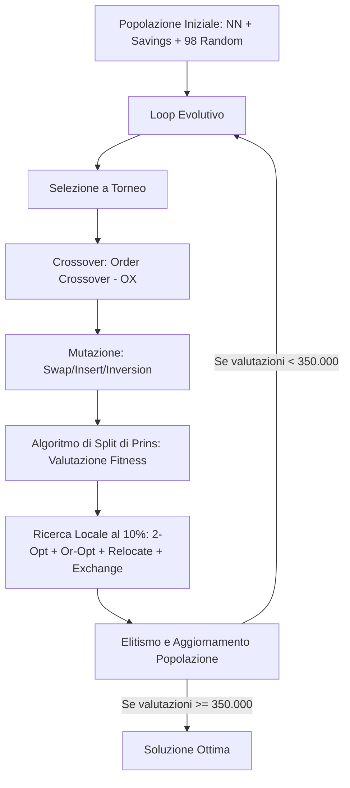

# Teoria e Architettura del Risolvitore CVRP (HGA)

Questo documento fornisce una spiegazione dettagliata e accademica dei concetti teorici, degli algoritmi e delle scelte implementative adottate nel progetto per la risoluzione del **Capacitated Vehicle Routing Problem (CVRP)** tramite **Algoritmo Genetico Ibrido (HGA)**.

---

## 1. Il Problema: Capacitated Vehicle Routing Problem (CVRP)

Il CVRP è un classico problema di ottimizzazione combinatoria NP-difficile. Può essere formalizzato come segue:

### Formulazione Matematica e Vincoli
Dato un grafo orientato o non orientato $G = (V, E)$, dove:
*   $V = \{0, 1, \dots, n\}$ è l'insieme dei nodi. Il nodo $0$ rappresenta il **deposito centrale (depot)**, mentre i nodi $\{1, \dots, n\}$ sono i **clienti**.
*   Ogni cliente $i \in V \setminus \{0\}$ ha una richiesta (domanda) associata $d_i > 0$.
*   Un insieme omogeneo di veicoli, ciascuno con capacità limitata $Q$.
*   Una matrice delle distanze $C$ dove $c_{ij}$ rappresenta il costo di viaggio (distanza euclidea) tra il nodo $i$ e il nodo $j$.

L'obiettivo è determinare un insieme di percorsi di costo minimo tali che:
1.  Ogni percorso parta e termini al deposito $0$.
2.  Ogni cliente venga visitato **esattamente una volta** da un solo veicolo.
3.  La somma delle domande dei clienti in qualsiasi percorso non superi la capacità del veicolo $Q$:
    $$\sum_{i \in R_k} d_i \le Q \quad \forall R_k$$

### 1.1 Come Vengono Calcolati i Valori Ottimi di Riferimento (BKS)

I valori ottimi (o *Best-Known Solutions*, BKS) associati a ciascuna istanza CVRP non sono calcolati dal nostro algoritmo genetico: sono pre-calcolati e memorizzati all'interno dei file `.vrp` nella riga `COMMENT` (es. `Optimal value: 1146` per `A-n45-k7`). Questa sezione spiega come la comunità scientifica è arrivata a determinare tali valori.

#### 1.1.1 Il Problema della Prova di Ottimalità

Il CVRP è un problema **NP-difficile**: trovare la soluzione ottima per forza bruta richiederebbe di esplorare uno spazio di $n!$ permutazioni, un'impresa computazionalmente impossibile già per $n = 50$ clienti. Per le istanze dei benchmark classici (set A, B, E, P, con $n$ fino a 101), i valori ottimi **non sono stati trovati per caso**: sono stati **provati matematicamente** tramite algoritmi esatti di ottimizzazione combinatoria.

La differenza tra un BKS e un ottimo provato è cruciale:

| Caratteristica | Best-Known Solution (BKS) | Ottimo Provato |
| :--- | :--- | :--- |
| **Definizione** | Il miglior costo trovato finora da qualsiasi algoritmo (euristico o esatto). | Il costo matematicamente minimo possibile. |
| **Certezza** | Potrebbe essere migliorabile: nessuno sa se esista una soluzione migliore. | Nessuna soluzione migliore può esistere — è un teorema matematico. |
| **Metodo** | Ottenuto tramite metaeuristiche (Genetici, Tabu Search, Simulated Annealing). | Ottenuto tramite algoritmi esatti (Branch-and-Cut, Branch-Cut-and-Price). |
| **Fornisce** | Un *upper bound* (limite superiore) al costo minimo. | L'esatto costo minimo. |

Per tutte le 10 istanze dei set A, B, E, P utilizzate in questo progetto, il BKS **coincide con l'ottimo provato**: ogni valore è stato certificato matematicamente da algoritmi esatti.

#### 1.1.2 Formulazione Matematica per gli Algoritmi Esatti

Gli algoritmi esatti non lavorano direttamente con permutazioni di clienti (come fa il nostro HGA), ma utilizzano formulazioni di **programmazione lineare intera (ILP)**.

**Formulazione a Due Indici (two-index vehicle flow).** La più classica formulazione ILP del CVRP utilizza variabili binarie $x_{ij} \in \{0, 1\}$ che indicano se un veicolo attraversa l'arco $(i, j)$. Il vincolo di capacità viene imposto tramite i cosiddetti *capacity cuts*:

$$\sum_{i \in S}\sum_{j \notin S} x_{ij} \ge \left\lceil \frac{\sum_{i \in S} d_i}{Q} \right\rceil \quad \forall S \subseteq V \setminus \{0\}, S \neq \emptyset$$

Questo vincolo stabilisce che, per ogni sottoinsieme di clienti $S$, il numero minimo di veicoli che devono entrare/uscire da $S$ è almeno il numero di veicoli necessario a soddisfarne la domanda totale. Poiché esistono $2^{n-1}$ sottoinsiemi, questi vincoli sono in numero esponenziale e **non possono essere inseriti tutti a priori**.

**Formulazione di Set Partitioning (SP).** Una formulazione più potente modella il CVRP come selezione di un sottoinsieme ottimo di rotte valide:

$$\min \sum_{r \in \Omega} c_r \lambda_r \quad \text{s.t.} \quad \sum_{r \in \Omega : i \in r} \lambda_r = 1 \; \; \forall i \in V \setminus \{0\}, \quad \lambda_r \in \{0, 1\}$$

dove $\Omega$ è l'insieme di **tutte le rotte ammissibili** (che rispettano la capacità $Q$), $c_r$ è il costo della rotta $r$, e $\lambda_r$ è una variabile binaria che vale 1 se la rotta $r$ è selezionata. Il vincolo impone che ogni cliente appartenga esattamente a una rotta selezionata.

Il problema di questa formulazione è che $|\Omega|$ (il numero totale di rotte possibili) è **astronomico** — anche per 50 clienti può superare $10^{20}$. Non è possibile enumerarle tutte.

#### 1.1.3 Algoritmi Esatti: Branch-and-Cut e Branch-Cut-and-Price

Per risolvere queste formulazioni in pratica, la comunità scientifica ha sviluppato famiglie di algoritmi esatti che combinano tecniche di **pianificazione lineare**, **teoria dei grafi** e **ricerca ad albero**:

**Branch-and-Cut (Lysgaard, Letchford & Eglese, 2004).**  
Questo algoritmo lavora sulla formulazione a due indici:
1. **Branch**: si costruisce un albero di ricerca in cui ogni nodo è un problema ILP rilassato (le variabili binarie $x_{ij}$ diventano continue $0 \le x_{ij} \le 1$).
2. **Cut**: risolto il rilassamento lineare (LP) al nodo corrente, si verifica se la soluzione frazionaria viola qualche capacity cut. I vincoli violati vengono **generati dinamicamente** risolvendo un problema di *min-cut* su un grafo ausiliario (procedura di separazione). Questi tagli vengono aggiunti al modello, "tagliando via" soluzioni frazionarie invalide.
3. **Bound**: il valore ottimo del LP rilassato (con tutti i tagli aggiunti) fornisce un *lower bound*. Se questo supera il miglior *upper bound* (costo della migliore soluzione intera trovata), il nodo viene potato: nessuna soluzione migliore può esistere in quel ramo.
4. Quando tutti i rami sono stati potati o risolti, la migliore soluzione intera superstite è **provatamente ottima**.

**Branch-Cut-and-Price (Fukasawa et al., 2006).**  
Questo algoritmo — considerato lo stato dell'arte per il CVRP — estende il Branch-and-Cut lavorando sulla formulazione di Set Partitioning:
- **Column Generation (Pricing)**: solo un piccolo sottoinsieme di rotte $\Omega' \subset \Omega$ viene mantenuto nel modello. Dopo aver risolto il *Master Problem* (MP) rilassato, si usa un *pricing subproblem* per scoprire se esistono rotte non ancora incluse che potrebbero migliorare la soluzione. Questo sottoproblema è uno **Shortest Path Problem with Resource Constraints (SPPRC)**: dato un grafo in cui ogni cliente ha un peso (la domanda $d_i$), trovare il cammino di costo minimo (con costo modificato dai *prezzi ombra* — o *duali* — del MP) che parte e torna al deposito rispettando il vincolo di capacità $Q$. Se il cammino trovato ha costo ridotto negativo, viene aggiunto come nuova colonna (rotta) al MP.
- **Cut**: come nel Branch-and-Cut, si aggiungono *rounded capacity cuts* per rafforzare il rilassamento.
- **Branch**: quando la soluzione LP è frazionaria, si brancha (tipicamente sul numero di veicoli o su archi specifici) per forzare l'interezza.
- Il processo si ripete a ogni nodo dell'albero di ricerca: **generazione di colonne + separazione di tagli + branching**.

**Lagrangian Relaxation (approccio storico).**  
Una tecnica alternativa per calcolare lower bound molto stretti è il rilassamento lagrangiano: i vincoli di assegnamento ($\sum_r \lambda_r = 1$) vengono spostati nella funzione obiettivo con moltiplicatori di Lagrange $\mu_i$. Il problema risultante si decompone in $m$ sottoproblemi indipendenti (uno per veicolo), ciascuno dei quali è uno SPPRC "puro" risolvibile efficientemente. I moltiplicatori $\mu_i$ vengono ottimizzati tramite **subgradient optimization**. Sebbene meno potente del Branch-Cut-and-Price moderno, il rilassamento lagrangiano ha storicamente fornito i primi lower bound competitivi per il CVRP.

#### 1.1.4 Schema Riassuntivo del Processo di Prova

```mermaid
flowchart TD
    A[Upper Bound: soluzione euristica iniziale<br/>(es. Clarke & Wright Savings)] --> B
    subgraph BCP [Branch-Cut-and-Price]
        B[Rilassamento LP del Master Problem] --> C[Column Generation:<br/>trova nuove rotte a costo ridotto negativo]
        C --> D[Separazione di Tagli:<br/>aggiungi capacity cuts violati]
        D --> E{LP ottimo = intero?}
        E -->|No| F[Branching: dividi il problema]
        F --> B
        E -->|Sì| G[Upper Bound aggiornato]
    end
    G --> H{Lower Bound ≥ Upper Bound<br/>in tutti i rami?}
    H -->|No| BCP
    H -->|Sì| I[✅ OTTIMO PROVATO]
```

Per le istanze dei set A, B, E, P utilizzate in questo progetto, il processo di Branch-Cut-and-Price ha certificato l'ottimalità in tempi che variano da pochi secondi (A-n45-k7) a diverse ore (E-n101-k14) su hardware scientifico. I valori così ottenuti sono quelli riportati nella riga `Optimal value` di ciascun file `.vrp` e costituiscono il riferimento (ground truth) contro cui valutiamo le performance del nostro HGA.

#### 1.1.5 Riferimenti Bibliografici

- Lysgaard, J., Letchford, A. N., & Eglese, R. W. (2004). *A new branch-and-cut algorithm for the capacitated vehicle routing problem.* Mathematical Programming, 100(2), 423–445.
- Fukasawa, R., Longo, H., Lysgaard, J., Aragão, M. P., Reis, M., Uchoa, E., & Werneck, R. F. (2006). *Robust branch-and-cut-and-price for the capacitated vehicle routing problem.* Mathematical Programming, 106(3), 491–511.
- Ralphs, T. K., Kopman, L., Pulleyblank, W. R., & Trotter, L. E. (2003). *On the capacitated vehicle routing problem.* Mathematical Programming, 94(2-3), 343–359.

---

## 2. L'Algoritmo Genetico Ibrido (HGA) o Memetico

Un algoritmo genetico classico modella i processi di selezione naturale ed evoluzione (crossover, mutazione). Tuttavia, per problemi complessi come il VRP, l'algoritmo genetico da solo rischia di convergere molto lentamente.

L'**HGA** (chiamato anche **Algoritmo Memetico**) unisce:
*   La capacità di esplorazione globale (**exploration**) dell'algoritmo genetico.
*   La capacità di raffinamento locale (**exploitation**) degli operatori di ricerca locale.



### Parametri e Protocollo Sperimentale (da Consegna)
L'algoritmo è governato da una serie di parametri chiave, definiti in `config/config.yaml`, che regolano il bilanciamento tra esplorazione e sfruttamento:

*   **Dimensione della popolazione ($N = 100$)**: Definisce il numero di soluzioni candidate mantenute contemporaneamente in memoria. Una popolazione più ampia favorisce la diversità genetica ma aumenta il tempo di calcolo.
*   **Valutazioni massime ($FE = 350.000$)**: Rappresenta il budget computazionale totale concesso all'HGA per ogni singola esecuzione. Il conteggio delle valutazioni viene incrementato a ogni invocazione del metodo di Split.
*   **Numero di run indipendenti ($\text{runs} = 5$)**: Poiché l'HGA è un algoritmo stocastico, è necessario eseguire più run indipendenti per ciascuna istanza per raccogliere statistiche statisticamente significative (costo migliore, costo medio, deviazione standard).
*   **Tasso di Crossover ($p_c = 0.8$)**: La probabilità con cui due genitori estratti dalla popolazione si incrociano (tramite Order Crossover - OX) per generare figli. Favorisce la trasmissione delle buone caratteristiche dei genitori alle generazioni successive.
*   **Tasso di Mutazione ($p_m = 0.1$)**: La probabilità che un figlio subisca una mutazione casuale. Introduce elementi di disturbo che prevengono la convergenza prematura su ottimi locali sub-ottimali.
*   **Tasso di Ricerca Locale ($p_{ls} = 0.1$)**: La probabilità che un figlio venga ottimizzato tramite i 4 operatori di ricerca locale. È il tasso di ibridazione che definisce l'algoritmo memetico.
*   **Dimensione del torneo ($k = 2$)**: Il numero di candidati estratti a caso per sfidarsi nella selezione dei genitori. Controlla la pressione selettiva dell'algoritmo genetico.
*   **Quota di Elitismo ($e = 2$)**: Il numero di individui migliori della generazione precedente che vengono copiati inalterati nella generazione successiva, garantendo la non-decrescenza della fitness ottima trovata.
*   **Iterazioni massime di Ricerca Locale ($\text{max\_iter} = 2$)**: Limita la scansione degli operatori di ricerca locale inter-route (Relocate ed Exchange) per evitare cicli infiniti ed ottimizzazioni infinitesimali, massimizzando il rendimento globale del tempo CPU.

---

## 3. Rappresentazione del Cromosoma e Algoritmo di Split di Prins

Una delle sfide principali del VRP è codificare una soluzione in un cromosoma (stringa). Esistono due modi:
1.  **Con delimitatori di percorso**: inserire degli "0" o dei delimitatori per separare i veicoli (es. `[0, 1, 2, 0, 3, 4, 5, 0]`). Questo approccio rende il crossover complesso e crea figli non validi.
2.  **Senza delimitatori (Permutazione semplice)**: Il cromosoma è solo una sequenza dei clienti (es. `[1, 2, 3, 4, 5]`). Viene usato un algoritmo ausiliario per determinare in modo ottimale dove spezzare la sequenza in rotte valide. Nel nostro progetto è implementato il secondo approccio tramite l'**Algoritmo di Split di Prins (2004)**.

### Algoritmo di Split (Programmazione Dinamica)
Dato un cromosoma $P = (p_1, p_2, \dots, p_n)$, definiamo un grafo ausiliario $H = (V_H, A_H)$ privo di cicli, dove i nodi sono gli indici da $0$ a $n$.
Un arco orientato $(i, j)$ (con $i < j$) esiste se il sottosegmento di clienti $(p_{i+1}, \dots, p_j)$ può essere servito da un singolo veicolo senza superare la capacità $Q$:
$$\sum_{k=i+1}^{j} d_{p_k} \le Q$$

Il costo dell'arco $(i, j)$ è pari al costo della rotta corrispondente:
$$w(i, j) = c_{0, p_{i+1}} + \sum_{k=i+1}^{j-1} c_{p_k, p_{k+1}} + c_{p_j, 0}$$

Il problema di trovare il partizionamento ottimale equivale a trovare il **cammino minimo** dal nodo $0$ al nodo $n$ nel grafo $H$. Questo cammino viene calcolato in tempo $O(N^2)$ usando la seguente equazione di ricorrenza di programmazione dinamica:
$$V(j) = \min_{i < j \text{ s.t. } \text{load}(i+1 \dots j) \le Q} \{ V(i) + w(i, j) \}$$
dove $V(j)$ rappresenta il costo ottimale per servire i primi $j$ clienti della permutazione.

---

## 4. Generazione della Popolazione Iniziale

La popolazione iniziale contiene 100 soluzioni:
1.  **1 soluzione** creata tramite l'euristica **Nearest Neighbor**:
    *   Partendo dal deposito, aggiunge ad ogni passo il cliente più vicino non ancora visitato che non viola la capacità residua. Se la capacità viene superata, il veicolo torna al deposito e un nuovo veicolo ricomincia il ciclo.
2.  **1 soluzione** creata tramite l'euristica **Savings (Clarke & Wright)**:
    *   Inizializza ciascun cliente in una rotta dedicata $0 \to i \to 0$.
    *   Calcola i risparmi energetici (savings) ottenuti unendo le rotte di $i$ e $j$: $s_{ij} = c_{i0} + c_{0j} - c_{ij}$.
    *   Ordina i risparmi in modo decrescente e unisce le rotte compatibili con il limite di capacità $Q$.
3.  **98 soluzioni** create tramite **Permutazioni Casuali**:
    *   I clienti vengono mescolati in modo casuale per garantire la massima varietà genetica.

Tutte queste permutazioni vengono poi passate all'algoritmo di Split per valutarne la fitness originaria.

---

## 5. Operatori Genetici

### Selezione
Viene utilizzata la **Selezione a Torneo (Tournament Selection)** con dimensione $k = 3$.
Si scelgono a caso 3 individui dalla popolazione e si seleziona quello con la fitness (costo) minore. Questo metodo offre un ottimo equilibrio tra pressione selettiva (far evolvere i migliori) e mantenimento della diversità genetica.

### Crossover: Order Crossover (OX)
L'Order Crossover è l'operatore ideale per le permutazioni perché preserva l'ordine relativo dei nodi evitando duplicati.
1.  Si scelgono due punti di taglio casuali all'interno dei cromosomi dei genitori.
2.  Il figlio eredita il segmento racchiuso tra i due tagli direttamente dal primo genitore.
3.  Le posizioni rimanenti del figlio vengono riempite scorrendo in senso orario gli elementi del secondo genitore (a partire dal secondo punto di taglio), saltando i nodi già ereditati.

### Mutazione
Per evitare la convergenza prematura, il $10\%$ dei figli subisce una mutazione. L'operatore di mutazione viene scelto a caso tra:
*   **Swap Mutation** ($40\%$ delle volte): Scambia di posizione due clienti scelti a caso nel cromosoma.
*   **Insert Mutation** ($30\%$ delle volte): Rimuove un cliente da una posizione e lo inserisce in un'altra.
*   **Inversion Mutation** ($30\%$ delle volte): Inverte l'ordine di un intero segmento casuale del cromosoma.

---

## 6. Ricerca Locale (Local Search)

La ricerca locale opera su una soluzione per migliorarla fino ad un ottimo locale. Nel nostro HGA, viene applicata con una probabilità del $10\%$ sui nuovi figli ed esegue in sequenza quattro operatori:

### Intra-Route (Ottimizzazione all'interno della stessa rotta)
1.  **2-opt**: Rimuove due archi non adiacenti della rotta e ricollega i nodi invertendo il segmento compreso tra essi. Serve a eliminare gli incroci di percorsi.
    *   *Calcolo dei costi accelerato*: Si calcola la differenza di costo (delta) guardando solo gli archi di frontiera:
        $$\Delta = (c_{i, j} + c_{i+1, j+1}) - (c_{i, i+1} + c_{j, j+1})$$
2.  **Or-opt**: Rimuove un segmento contiguo di clienti (di lunghezza 1, 2 o 3) da una posizione della rotta e prova ad inserirlo in un'altra posizione della stessa rotta.

### Inter-Route (Ottimizzazione tra rotte diverse)
3.  **Relocate**: Sposta un cliente da una rotta ad un'altra rotta, controllando che il veicolo di arrivo abbia capacità residua sufficiente per accoglierlo.
4.  **Exchange**: Prende un cliente dalla rotta A e un cliente dalla rotta B e ne scambia le posizioni, verificando che i limiti di capacità di entrambi i veicoli siano rispettati.

---

## 7. Dettagli di Ottimizzazione del Codice (Performance)

Per rendere fattibile l'esecuzione di 350.000 valutazioni in tempi ragionevoli su CPU, sono state implementate tre ottimizzazioni fondamentali:

1.  **Compilazione JIT con Numba**:
    Le funzioni a maggior impatto computazionale (`split_numba`, `two_opt_numba` e `or_opt_numba`) sono state implementate in moduli ottimizzati e decorate con `@jit(nopython=True)` di Numba. Numba traduce queste funzioni direttamente in codice macchina ottimizzato per la CPU al primo avvio, garantendo prestazioni vicine a quelle di un codice scritto in C.
2.  **Valutazioni dei Costi Delta (Delta Cost Evaluation)**:
    Nelle funzioni di ricerca locale inter-route (`Relocate` e `Exchange`), per valutare se uno spostamento è vantaggioso, non ricalcoliamo la lunghezza di tutte le rotte. Calcoliamo solo il costo prima e dopo delle 2 rotte modificate:
    $$\Delta = (\text{costo}_{\text{A, dopo}} + \text{costo}_{\text{B, dopo}}) - (\text{costo}_{\text{A, prima}} + \text{costo}_{\text{B, prima}})$$
    Questo trasforma un'operazione $O(N)$ (dove $N$ è la dimensione del problema) in un'operazione $O(K)$ (dove $K$ è la lunghezza media di una singola rotta, tipicamente $< 10$ nodi).
3.  **Mutazioni In-Place**:
    Invece di creare copie di liste ad ogni tentativo di mossa (che causava rallentamenti nella gestione della memoria), le mosse vengono tentate modificando le liste di rotte originali "in-place" e ripristinandole immediatamente dopo il calcolo del costo (backtracking). La copia della lista avviene solo quando la mossa viene effettivamente accettata come migliore.
4.  **Limite alle Iterazioni di Ricerca Locale (`max_iter = 2`)**:
    Limitando le iterazioni dei cicli di ricerca locale a un massimo di 2 passate per chiamata, evitiamo che l'algoritmo perda tempo prezioso a inseguire miglioramenti infinitesimali su singoli individui, massimizzando il rendimento globale dell'evoluzione del pool genetico.

---

## 8. Visualizzazione dei Risultati

Lo script `plot_convergence.py` genera automaticamente **nove tipologie di grafici** in stile editoriale (font serif, palette Tol Vibrant, 300 DPI), suddivisi in due categorie:

### 8.1 Grafici per Istanza (3 istanze rappresentative)

**8.1.1 Grafici di Convergenza** (`convergence_<nome>.png`)

Illustrano il processo di apprendimento dell'HGA per le istanze `A-n45-k7`, `E-n76-k8` e `P-n101-k4`, mostrando l'evoluzione del miglior costo in funzione del numero di valutazioni della fitness (FE). Ogni grafico include:
- Le curve delle 5 run indipendenti (grigio chiaro semi-trasparente)
- La banda di deviazione standard (±1σ) attorno alla media (blu tenue)
- La curva del costo medio (blu pieno)
- L'inviluppo della run migliore (verde tratteggiato)
- La linea del valore BKS (*best-known solution*), se noto (rosso punteggiato)
- Titolo compatto con nome istanza, best cost, gap % e numero di run

**8.1.2 Grafici delle Rotte Migliori** (`routes_<nome>.png`)

Forniscono una visualizzazione geospaziale della migliore soluzione complessiva trovata tra tutte le 5 run per ciascuna istanza rappresentativa. Su una mappa 2D vengono disegnati:
- Il **deposito** come diamante rosso (`#CC3311`) con legenda dedicata
- I **nodi cliente** come cerchi grigio-scuro, dimensionati proporzionalmente alla domanda (da 18 a 120 pt² con legenda *Demand*)
- Le **rotte dei veicoli** come archi curvi colorati con frecce direzionali (curvatura alternata `arc3,rad=±0.10` per evitare sovrapposizioni)
- Un'**etichetta numerata** (①, ②, …) al midpoint del primo arco depot→cliente di ciascuna rotta
- Nel titolo: nome istanza, costo, gap %, veicoli utilizzati/disponibili e numero di clienti

La palette è la Tol Vibrant qualitativa (20 colori, colorblind-friendly).

### 8.2 Grafici Riassuntivi (tutte le istanze disponibili)

**8.2.1 Confronto Best vs BKS** (`summary_best_vs_bks.png`)

Grafico a barre raggruppate che confronta, per ogni istanza con BKS noto, il miglior costo trovato dall'HGA (barra colorata per set) con il valore ottimo di riferimento (barra grigia tratteggiata). Il gap percentuale è annotato sopra ogni barra HGA. Fornisce una visione d'insieme immediata della qualità delle soluzioni.

**8.2.2 Gap dall'Ottimo** (`summary_gap.png`)

Barre orizzontali (verticali con rotazione) che mostrano lo scostamento percentuale `(best − BKS) / BKS × 100` per ogni istanza. Le barre sono colorate per set (A: blu, B: arancione, E: verde, P: rosso) con il valore esatto annotato. Una linea di zero al 0% separa visivamente i gap positivi.

**8.2.3 Box Plot della Distribuzione dei Costi** (`summary_boxplot.png`)

Box plot normalizzati per BKS (`costo / BKS × 100`) che mostrano la distribuzione dei costi delle 5 run indipendenti per ogni istanza. La normalizzazione rende comparabile la variabilità tra istanze di scala diversa. Include:
- Riquadri colorati per set con trasparenza
- Mediana in grigio scuro
- Outlier in rosso
- Linea di riferimento al 100% (BKS)
- Utile per valutare la **stabilità** e **robustezza** dell'algoritmo

**8.2.4 Tempo di Esecuzione vs Dimensione** (`summary_runtime.png`)

Scatter plot che mette in relazione il tempo di esecuzione totale (5 run) con la dimensione dell'istanza (numero di nodi). Ogni punto è colorato per set ed etichettato con il nome dell'istanza. Mostra la **scalabilità computazionale** dell'HGA al crescere della taglia del problema.

**8.2.5 Radar Chart Comparativa per Set** (`summary_radar.png`)

Grafico radar (spider) che confronta le performance normalizzate dei 4 set (A, B, E, P) su 5 metriche aggregate:
1. **Route length** — lunghezza media delle rotte (clienti per veicolo, più bassa = rotte più bilanciate)
2. **Stability** — coefficiente di variazione medio `std_dev/mean` (più basso = più stabile)
3. **Gap %** — gap percentuale medio dal BKS
4. **Time/node** — tempo di esecuzione medio per nodo (secondi)
5. **Convergence** — numero medio di generazioni per raggiungere il best

Ogni metrica è normalizzata con **soft range $[0.15, 1.0]$** (anziché $[0, 1]$) per evitare che il set peggiore collassi a zero su un asse, mantenendo sempre un footprint visibile. L'area colorata di ciascun set fornisce un'impronta visiva immediata della sua performance complessiva.

**8.2.6 Generazioni per Raggiungere il Best** (`summary_generations.png`)

Grafico a barre colorato per set con barre d'errore (±1 deviazione standard) che mostra il numero medio di generazioni necessarie all'HGA per raggiungere la migliore soluzione in ciascuna istanza. Ogni barra riporta l'annotazione `media±s.d.`. Questo grafico evidenzia la **velocità di convergenza** dell'algoritmo: valori più bassi indicano che l'HGA trova rapidamente buone soluzioni, valori più alti suggeriscono una convergenza più lenta o un landscape di fitness più complesso.

**8.2.7 Lunghezza Media delle Rotte** (`summary_route_length.png`)

Grafico a barre colorato per set che mostra il numero medio di clienti per veicolo (lunghezza della rotta) nella migliore soluzione trovata per ogni istanza. Il valore è annotato sopra ogni barra. Una lunghezza media più bassa indica rotte più corte e potenzialmente più bilanciate; una più alta riflette istanze con pochi veicoli rispetto al numero di clienti, che costringono a rotte più lunghe.

Tutti i grafici vengono salvati nelle rispettive sottocartelle di `docs/report/imgs/` in formato PNG a 300 DPI con sfondo bianco, pronti per l'inclusione nella relazione LaTeX.
